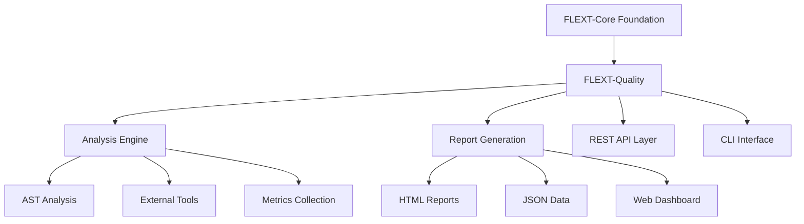

# FLEXT Quality

[](https://www.python.org/downloads/)
[](https://github.com/flext-sh/flext-quality)

**Code quality analysis library** for the FLEXT ecosystem, providing quality metrics and analysis capabilities using Domain-Driven Design patterns.

> **📊 STATUS**: Version 0.9.9 - Solid domain architecture with critical accessibility and integration gaps

---

## 🎯 Purpose and Role in FLEXT Ecosystem

### **For the FLEXT Ecosystem**

FLEXT Quality serves as the centralized code quality analysis platform for all FLEXT projects, providing consistent quality metrics, analysis patterns, and reporting across the ecosystem's Python projects.

### **Key Responsibilities**

1. **Quality Analysis** - Automated code quality assessment using multiple analysis backends
1. **Metrics Collection** - Comprehensive quality metrics with scoring and grading systems
1. **Report Generation** - HTML, JSON, and text reporting with executive summaries
1. **FLEXT Integration** - Native integration with FLEXT architectural patterns

### **Integration Points**

- **flext-core** → Uses FlextResult, FlextContainer, FlextModels for foundation patterns
- **flext-cli** → Command-line interface integration (currently blocked by import issues)
- **flext-web** → Web dashboard integration (planned)
- **All FLEXT Projects** → Quality analysis and validation for Python codebases

---

## 🏗️ Architecture and Patterns

### **Implementation Status Assessment**

| Component | Status | Details |
| --- | --- | --- |
| **Domain Architecture** | ✅ **Complete** | Proper entity design, FlextResult patterns, domain events |
| **Service Layer** | ✅ **Functional** | services with FlextLogger integration |
| **Core Analyzer** | ❌ **Inaccessible** | FlextQualityCodeAnalyzer implemented but blocked by imports |
| **Quality Gates** | ❌ **Blocked** | Import failures prevent type checking and testing |
| **FLEXT Integration** | ⚠️ **Partial** | Uses flext-core patterns but has BaseModel compatibility |
| **Documentation** | ⚠️ **Outdated** | Status indicators need synchronization across files |

> **Status**: Solid foundation with accessibility and integration barriers requiring resolution · 1.0.0 Release Preparation

### **Architecture Overview**



---

## 🚀 Quick Start

### **Installation**

```bash
git clone https://github.com/flext-sh/flext-quality.git
cd flext-quality
make setup

# Verify core functionality
python -c "
from flext_quality import FlextQualityService, QualityGradeCalculator
print('Core imports successful')
"
```

### **Basic Usage**

```python
from flext_quality import FlextQualityService

# Service Layer Usage (Recommended)
def main():
    service = FlextQualityService()

    # Create project with quality thresholds
    result = service.create_project(
        name="my_project",
        project_path="/path/to/project",
        _min_coverage=80.0,  # Note: internal parameter naming
        _max_complexity=10
    )

    if result.success:
        project = result.value
        print(f"✅ Project: {project.name}")
        print(f"📁 Path: {project.project_path}")
        print(f"📊 Coverage threshold: {project.min_coverage}%")

# Core Analyzer Usage (Direct Import Required)
def analyze_code():
    # Note: Core analyzer not in main exports - requires direct import
    from flext_quality.analyzer import FlextQualityCodeAnalyzer

    analyzer = FlextQualityCodeAnalyzer("/path/to/project")
    result = analyzer.analyze_project()

    print(f"📊 Quality Score: {analyzer.get_quality_score()}")
    print(f"🏆 Quality Grade: {analyzer.get_quality_grade()}")
    print(f"📄 Files Analyzed: {result.overall_metrics.files_analyzed}")
    print(f"🔍 Total Issues: {result.total_issues}")

# Run analysis
run(main())
analyze_code()
```

---

## 🔧 Quality Assurance

The FLEXT ecosystem provides comprehensive automated quality assurance:

- **Pattern Analysis**: Automatic detection of architectural violations and duplication
- **Consolidation Guidance**: SOLID-based refactoring recommendations
- **Batch Operations**: Safe, automated fixes with backup and rollback
- **Quality Gates**: Enterprise-grade validation before integration

### Development Standards

- **Architecture Compliance**: Changes maintain layering and dependencies
- **Type Safety**: Complete type coverage maintained
- **Test Coverage**: All changes include comprehensive tests
- **Quality Validation**: Automated checks ensure standards are met


## 🔧 Development

### **Essential Commands**

```bash

# Setup and installation
make setup              # Complete development environment setup
make install            # Install dependencies only

# Quality gates
make validate           # Complete validation pipeline
make check             # Quick validation (lint + type-check)
make lint              # Ruff linting
make type-check        # MyPy type checking (currently produces errors)
make security          # Security scanning with Bandit

# Testing (currently blocked by import errors)
make test              # Run test suite with coverage
make test-unit         # Unit tests only
make test-integration  # Integration tests

# Quality analysis commands (when CLI is fixed)
make analyze           # Run quality analysis
make quality-check     # Validate quality thresholds
make report           # Generate quality reports

# Development utilities
make format           # Auto-format code
make clean            # Clean build artifacts
make diagnose         # System diagnostics
```

### **Current Development Barriers**

```bash

# Critical integration issues blocking all functionality:

# Model compatibility - FlextModels.BaseModel doesn't exist
python -c "from flext_quality import CodeAnalyzer"  # AttributeError

# All imports blocked by model inheritance issues
make test       # AttributeError: FlextModels has no attribute 'BaseModel'

# Type checking cannot run until imports work
make type-check  # Blocked by import failures

# Core analyzer exists but inaccessible via standard imports
python -c "from flext_quality.analyzer import FlextQualityCodeAnalyzer"  # Works
```

---

## 🧪 Testing

### **Test Structure**

```
tests/
├── unit/                   # Unit tests for individual components
├── integration/           # Integration tests (currently blocked)
├── conftest.py           # Pytest configuration and fixtures
└── test_*.py            # Test modules (import issues present)
```

### **Testing Commands**

```bash

# Basic test execution
pytest tests/test_basic.py --no-cov    # Works: Basic tests execute successfully
make test                             # Limited: Coverage configuration issues
make test-unit                        # Individual test modules work

# Diagnostic command
make diagnose          # Check system status and dependencies
```

---

## 📊 Status and Metrics

### **Implementation Assessment**

Evidence-based analysis of current state:

- **✅ Domain Architecture**: Complete - Well-designed entities with FlextResult patterns
- **✅ Service Layer**: Functional - operations with proper error handling
- **⚠️ Analysis Engine**: Implemented - AST analysis, quality scoring, grade calculation (but blocked by imports)
- **❌ Accessibility**: Core analyzer inaccessible due to FlextModels.BaseModel compatibility issues
- **❌ Quality Gates**: Import failures prevent type checking and test execution
- **⚠️ FLEXT Integration**: Partial - uses flext-core patterns but has model compatibility issues

### **Quality Standards**

- **Coverage**: Cannot measure - import failures prevent test execution
- **Type Safety**: Cannot assess - import failures prevent type checking execution
- **Security**: Ruff security checks pass, external security analysis needs completion
- **FLEXT-Core Compliance**: Domain layer good, model integration layer has compatibility issues

### **Development Requirements**

- **Model Compatibility**: Fix FlextModels.BaseModel compatibility issues in models.py
- **Import Accessibility**: Enable standard imports once model issues are resolved
- **Quality Gate Compliance**: Resolve MyPy type errors after imports work
- **Test Infrastructure**: Fix import issues to enable automated testing and coverage
- **FLEXT Integration**: Complete flext-core integration and model compatibility

---

## 🗺️ Roadmap

### **Current Version (v0.9.9)**

Focus on critical accessibility and integration gaps:

- Export core analyzer in main module interface
- Resolve 2 MyPy type errors blocking quality gates
- Fix test import issues to enable automated testing
- Enhance integration with modern Python quality ecosystem

### **Next Version (v0.10.0)**

Ecosystem integration and enhancement:

- Complete integration with 2025 Python quality tools
- Implement comprehensive test coverage measurement
- Add advanced analysis capabilities (Semgrep, AI-assisted analysis)
- Optimize performance for large codebase analysis

---

## 📚 Documentation

- **[TODO & Development Status](TODO.md)** - Current technical issues and development priorities
- **[Getting Started](docs/getting-started.md)** - Installation and basic usage

---

## 🤝 Contributing
### Quality Standards

All contributions must:
- Maintain architectural layering and dependency rules
- Preserve complete type safety
- Follow established testing patterns
- Pass automated quality validation


### **FLEXT-Core Compliance Checklist**

Before contributing, ensure code follows FLEXT patterns:

- [ ] All operations return FlextResult\[T\] for type-safe error handling
- [ ] Use FlextContainer.get_global() for dependency injection
- [ ] Follow single unified class per module pattern
- [ ] Use FlextModels for domain entities
- [ ] Complete type annotations with Python 3.13+ features

### **Quality Standards**

- **Type Safety**: Zero MyPy errors in strict mode
- **Testing**: Minimum test coverage once import issues resolved
- **Code Style**: Ruff formatting with 88-character line limit
- **Security**: Zero Bandit security issues

### **Current Contribution Priorities**

1. **Export core analyzer** in main module interface for user accessibility
1. **Resolve type errors** preventing MyPy compliance and quality gates
1. **Fix test imports** to enable automated testing and coverage measurement
1. **Enhance modern tool integration** with 2025 Python quality ecosystem

---

## 📄 License

MIT License - see [LICENSE](LICENSE) for details.

---

## 🆘 Support

- **Documentation**: [docs/](docs/)
- **Issues**: [GitHub Issues](https://github.com/flext-sh/flext-quality/issues)
- **Security**: Report security issues privately to maintainers

---

**FLEXT Quality v0.9.9** - Code quality analysis library with solid domain architecture and functional analysis capabilities requiring accessibility improvements.

**Mission**: Provide comprehensive code quality analysis for FLEXT projects with proper domain-driven design patterns and integration with modern Python quality ecosystem tools.
