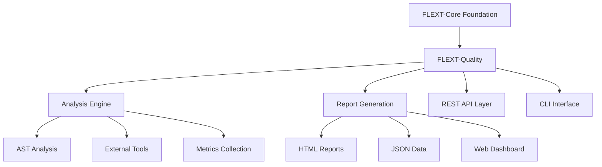

# FLEXT Quality

[](https://www.python.org/downloads/)
[](#current-status)

**Code quality analysis platform** for the FLEXT ecosystem, providing **comprehensive quality metrics** using **Domain-Driven Design patterns** with **enterprise analysis capabilities**.

> **⚠️ STATUS**: Version 0.9.0 development - Technical integration issues require resolution before production use

---

## 🎯 Purpose and Role in FLEXT Ecosystem

### **For the FLEXT Ecosystem**

FLEXT Quality serves as the centralized code quality analysis platform for all FLEXT projects, providing consistent quality metrics, analysis patterns, and reporting across the ecosystem's Python projects.

### **Key Responsibilities**

1. **Quality Analysis** - Automated code quality assessment using multiple analysis backends
2. **Metrics Collection** - Comprehensive quality metrics with scoring and grading systems
3. **Report Generation** - HTML, JSON, and text reporting with executive summaries
4. **FLEXT Integration** - Native integration with FLEXT architectural patterns

### **Integration Points**

- **flext-core** → Uses FlextResult, FlextContainer, FlextModels for foundation patterns
- **flext-cli** → Command-line interface integration (currently blocked by import issues)
- **flext-web** → Web dashboard integration (planned)
- **All FLEXT Projects** → Quality analysis and validation for Python codebases

---

## 🏗️ Architecture and Patterns

### **FLEXT-Core Integration Status**

| Pattern             | Status         | Description             |
| ------------------- | -------------- | ----------------------- |
| **FlextResult[T]**  | 🟡 Partial 70% | Railway-oriented programming partially implemented |
| **FlextModels**     | 🟢 Complete 95% | Domain modeling with Entity/Value/AggregateRoot |
| **FlextContainer**  | 🟡 Partial 60% | DI container usage inconsistent |
| **Domain Patterns** | 🟢 Complete 90% | Clean DDD implementation with proper separation |

> **Status**: 🟡 Partial implementation - Technical issues prevent full FLEXT compliance

### **Architecture Overview**



---

## 🚀 Quick Start

### **Installation**

```bash
git clone https://github.com/flext-sh/flext-quality.git
cd flext-quality
make setup

# Verify core functionality
python -c "
from flext_quality import FlextQualityService, QualityGradeCalculator
print('Core imports successful')
"
```

### **Basic Usage**

```python
from flext_quality import FlextQualityService
from flext_core import FlextResult

# Initialize quality service
quality_service = FlextQualityService()

# Analyze project (when working)
# Note: Currently blocked by type safety issues
try:
    result = quality_service.analyze_project("/path/to/project")
    if result.success:
        analysis = result.value
        print(f"Quality Score: {analysis.overall_score}")
except ImportError as e:
    print(f"Integration issue: {e}")
```

---

## 🔧 Development

### **Essential Commands**

```bash
# Setup and installation
make setup              # Complete development environment setup
make install            # Install dependencies only

# Quality gates
make validate           # Complete validation pipeline
make check             # Quick validation (lint + type-check)
make lint              # Ruff linting
make type-check        # MyPy type checking (currently produces errors)
make security          # Security scanning with Bandit

# Testing (currently blocked by import errors)
make test              # Run test suite with coverage
make test-unit         # Unit tests only
make test-integration  # Integration tests

# Quality analysis commands (when CLI is fixed)
make analyze           # Run quality analysis
make quality-check     # Validate quality thresholds
make report           # Generate quality reports

# Development utilities
make format           # Auto-format code
make clean            # Clean build artifacts
make diagnose         # System diagnostics
```

### **Current Development Limitations**

```bash
# Known issues that prevent full functionality:

# Type checking produces errors
make type-check  # Shows parameter mismatch errors

# Tests cannot execute due to import issues
make test       # ImportError while importing test modules

# CLI commands fail
flext-quality --help  # ImportError: cannot import from 'flext_cli'
```

---

## 🧪 Testing

### **Test Structure**

```
tests/
├── unit/                   # Unit tests for individual components
├── integration/           # Integration tests (currently blocked)
├── conftest.py           # Pytest configuration and fixtures
└── test_*.py            # Test modules (import issues present)
```

### **Testing Commands**

```bash
# Current status: Tests blocked by import errors
make test              # Produces ImportError
make test-unit         # Unit tests (when imports are fixed)
make coverage-html     # HTML coverage report (when tests run)

# Diagnostic command
make diagnose          # Check system status and dependencies
```

---

## 📊 Status and Metrics

### **Current Implementation Status**

- **Analysis Engine**: Functional - Basic code analysis capabilities work
- **Domain Models**: Complete - Excellent DDD implementation with FlextModels
- **Service Layer**: Partial - CRUD operations available, business logic incomplete
- **API Layer**: Incomplete - Multiple methods return "not implemented"
- **CLI Interface**: Blocked - Import errors prevent command execution
- **Test Suite**: Blocked - Import errors prevent test execution

### **Quality Standards**

- **Coverage**: Target 85% (currently cannot measure due to test issues)
- **Type Safety**: Type errors present (MyPy produces parameter mismatch errors)
- **Security**: Bandit scanning functional
- **FLEXT-Core Compliance**: Approximately 70% - foundation patterns partially implemented

### **Technical Debt**

- **Type Safety**: Parameter naming mismatches between API and Service layers
- **Import Issues**: CLI integration blocked by flext-cli import problems
- **Test Infrastructure**: Import errors prevent test execution
- **Multiple Classes**: FLEXT standard violation with multiple classes per module

---

## 🗺️ Roadmap

### **Current Version (v0.9.0)**

Focus on resolving foundational technical issues:
- Fix type safety violations (MyPy errors)
- Resolve import issues blocking tests and CLI
- Implement placeholder API methods
- Align with FLEXT architectural patterns

### **Next Version (v0.10.0)**

Enhancement phase after technical issues resolved:
- Complete test coverage implementation
- Full FLEXT-CLI integration
- Web dashboard integration
- Performance optimization

---

## 📚 Documentation

- **[TODO & Development Status](TODO.md)** - Current technical issues and development priorities
- **[Getting Started](docs/getting-started.md)** - Installation and basic usage
- **[Architecture](docs/architecture.md)** - System design and patterns
- **[Development](docs/development.md)** - Contributing and workflows
- **[Troubleshooting](docs/troubleshooting.md)** - Common issues and solutions

---

## 🤝 Contributing

### **FLEXT-Core Compliance Checklist**

Before contributing, ensure code follows FLEXT patterns:
- [ ] All operations return FlextResult[T] for type-safe error handling
- [ ] Use FlextContainer.get_global() for dependency injection
- [ ] Follow single unified class per module pattern
- [ ] Use FlextModels for domain entities
- [ ] Complete type annotations with Python 3.13+ features

### **Quality Standards**

- **Type Safety**: Zero MyPy errors in strict mode
- **Testing**: Minimum test coverage once import issues resolved
- **Code Style**: Ruff formatting with 88-character line limit
- **Security**: Zero Bandit security issues

### **Current Contribution Priorities**

1. **Fix import issues** preventing test execution
2. **Resolve type safety** violations in API-Service integration
3. **Implement placeholder API methods** with proper FlextResult usage
4. **CLI integration** using pure flext-cli patterns

---

## 📄 License

MIT License - see [LICENSE](LICENSE) for details.

---

## 🆘 Support

- **Documentation**: [docs/](docs/)
- **Issues**: [GitHub Issues](https://github.com/flext-sh/flext-quality/issues)
- **Security**: Report security issues privately to maintainers

---

**FLEXT Quality v0.9.0** - Code quality analysis platform enabling consistent quality standards across the FLEXT ecosystem.

**Mission**: Provide reliable, comprehensive code quality analysis for FLEXT projects while maintaining enterprise-grade accuracy and FLEXT architectural compliance.