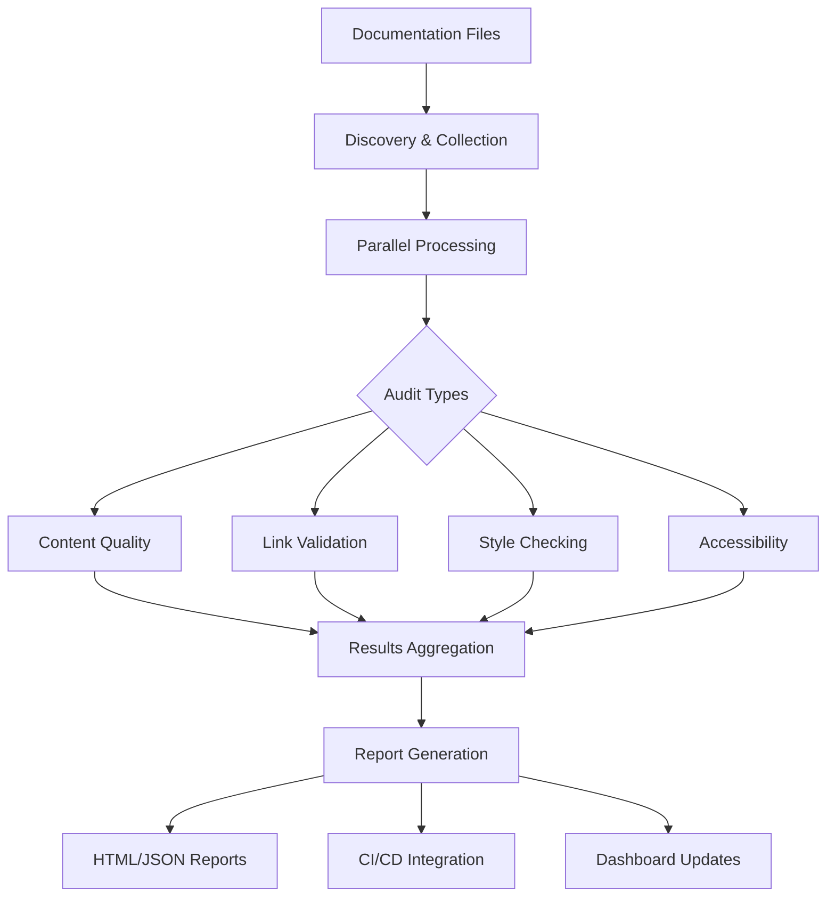

# Documentation Maintenance & Quality Assurance System

**Version**: 1.0.0 | **Status**: Active | **Updated**: 2025-10-10

Comprehensive documentation maintenance framework providing automated quality assurance, validation, optimization, and reporting for FLEXT Quality documentation.

## 🎯 Purpose

Maintain high-quality, accurate, and consistent documentation through automated systems that ensure:
- Content freshness and completeness
- Link and reference validation
- Style consistency and accessibility
- Automated quality assurance reporting
- Version control integration

## 🏗️ System Architecture

### Core Components

```
docs/maintenance/
├── README.md                 # This file - system overview and setup guide
├── demo.py                   # Interactive demonstration of all features
├── scripts/                  # Executable maintenance scripts
│   ├── audit.py             # Comprehensive documentation audit system
│   ├── validate.py          # Link and reference validation engine
│   ├── optimize.py          # Content optimization and enhancement tools
│   └── report.py            # Quality assurance reporting and analytics
├── config/                   # Configuration files (customizable)
│   ├── audit_rules.yaml     # Quality audit rules and severity thresholds
│   ├── style_guide.yaml     # Style and formatting guidelines
│   └── validation_config.yaml # Validation settings and timeouts
├── reports/                  # Generated reports and historical data
│   ├── latest_audit.json    # Most recent comprehensive audit results
│   ├── audit_history/       # Historical audit data and trends
│   └── quality_metrics.json # Aggregated quality metrics over time
└── tools/                    # Specialized utility tools
    ├── link_checker.py      # Advanced external/internal link validation
    ├── style_validator.py   # Style consistency and accessibility checking
    └── content_analyzer.py  # Content quality and readability analysis
```

### Data Flow Architecture



## 📦 Installation & Setup

### Prerequisites
- **Python**: 3.8 or higher
- **Dependencies**: pyyaml, requests, beautifulsoup4, aiohttp, jinja2

### Quick Installation
```bash

# Install core dependencies
pip install pyyaml requests beautifulsoup4

# For full functionality (async validation, HTML reports)
pip install aiohttp jinja2

# Optional: For advanced content analysis
pip install nltk  # For enhanced readability analysis
```

### Directory Structure Setup
```bash

# Ensure you're in the project root
cd /path/to/flext-quality

# The maintenance system should be properly set up at:
ls docs/maintenance/

# README.md  demo.py  scripts/  config/  tools/  reports/
```

### Configuration Validation
```bash

# Verify configuration files exist
ls docs/maintenance/config/

# audit_rules.yaml  style_guide.yaml  validation_config.yaml

# Test configuration loading
python -c "
from docs.maintenance.scripts.audit import DocumentationAuditor
auditor = DocumentationAuditor()
print('✅ Configuration loaded successfully')
"
```

## 🚀 Quick Start

### Interactive Demo
```bash

# Run the complete interactive demonstration
cd docs/maintenance
python demo.py
```

### Run Complete Audit
```bash
cd docs/maintenance
python scripts/audit.py --comprehensive --output ../reports/
```

### Validate Links and References
```bash
python scripts/validate.py --external-links --internal-links --images
```

### Generate Quality Report
```bash
python scripts/report.py --format html --output ../reports/quality-report.html
```

### Automated Maintenance (CI/CD)
```bash

# Add to CI/CD pipeline
python docs/maintenance/scripts/audit.py --ci-mode --fail-on-errors

# Generate and publish reports
python docs/maintenance/scripts/report.py --format html --publish
```

## 🔄 CI/CD Integration & Automation

### GitHub Actions Example
```yaml

# .github/workflows/docs-maintenance.yml
name: Documentation Maintenance
on:
  schedule:
    - cron: '0 9 * * *'  # Daily at 9 AM UTC
  pull_request:
    paths:
      - 'docs/**'
      - '*.md'
  workflow_dispatch:    # Manual trigger

jobs:
  audit:
    runs-on: ubuntu-latest
    steps:
      - uses: actions/checkout@v4

      - name: Setup Python
        uses: actions/setup-python@v4
        with:
          python-version: '3.11'

      - name: Install dependencies
        run: |
          pip install pyyaml requests beautifulsoup4 aiohttp jinja2

      - name: Run Documentation Audit
        id: audit
        run: |
          cd docs/maintenance
          python scripts/audit.py --ci-mode --output ../reports/
        continue-on-error: true

      - name: Generate Report
        run: |
          cd docs/maintenance
          python scripts/report.py --format html --output ../reports/

      - name: Upload Reports
        uses: actions/upload-artifact@v3
        with:
          name: docs-maintenance-reports
          path: docs/reports/

      - name: Comment on PR (if applicable)
        if: github.event_name == 'pull_request'
        uses: actions/github-script@v6
        with:
          script: |
            const fs = require('fs');
            const reportPath = 'docs/reports/latest_audit.json';

            if (fs.existsSync(reportPath)) {
              const report = JSON.parse(fs.readFileSync(reportPath, 'utf8'));
              const score = report.metrics?.quality_score || 0;

              github.rest.issues.createComment({
                issue_number: context.issue.number,
                owner: context.repo.owner,
                repo: context.repo.repo,
                body: `## 📊 Documentation Quality Check

**Quality Score:** ${score}/100

**Issues Found:** ${report.metrics?.total_issues || 0}
- Critical: ${report.metrics?.severity_breakdown?.critical || 0}
- High: ${report.metrics?.severity_breakdown?.high || 0}
- Medium: ${report.metrics?.severity_breakdown?.medium || 0}

[📄 View Full Report](${{ github.server_url }}/${{ github.repository }}/actions/runs/${{ github.run_id }})`
              });
            }

      - name: Fail on Critical Issues
        if: steps.audit.outcome == 'failure'
        run: |
          echo "❌ Documentation audit found critical issues"
          exit 1
```

### GitLab CI Example
```yaml

# .gitlab-ci.yml (partial)
docs_maintenance:
  stage: test
  script:
    - cd docs/maintenance
    - pip install pyyaml requests beautifulsoup4 aiohttp jinja2
    - python scripts/audit.py --ci-mode --fail-on-errors
    - python scripts/report.py --format html --output ../reports/
  artifacts:
    paths:
      - docs/reports/
    expire_in: 1 week
  only:
    - merge_requests
    - schedules  # For daily runs

# Scheduled pipeline for regular maintenance
docs_daily_audit:
  stage: maintenance
  script:
    - cd docs/maintenance
    - python scripts/audit.py --comprehensive --output ../reports/
    - python scripts/report.py --format html --notify-webhook
  only:
    schedules:
      - "Daily Documentation Audit"
```

### Pre-commit Hooks
```bash

# .pre-commit-config.yaml
repos:
  - repo: local
    hooks:
      - id: docs-style-check
        name: Documentation Style Check
        entry: python docs/maintenance/tools/style_validator.py
        language: system
        files: \.(md|mdx)$
        pass_filenames: true

      - id: docs-link-check
        name: Documentation Link Check
        entry: python docs/maintenance/scripts/validate.py
        language: system
        files: \.(md|mdx)$
        args: [--internal-links]
        pass_filenames: true
```

### Scheduled Maintenance
```bash

# Add to crontab for regular maintenance

# Daily quality checks
0 9 * * * cd /path/to/flext-quality && python docs/maintenance/scripts/audit.py --daily --output docs/maintenance/reports/

# Weekly comprehensive audit
0 10 * * 1 cd /path/to/flext-quality && python docs/maintenance/scripts/audit.py --comprehensive --output docs/maintenance/reports/

# Monthly trend analysis and reporting
0 11 1 * * cd /path/to/flext-quality && python docs/maintenance/scripts/report.py --monthly-trends --notify
```

## 📊 Quality Metrics

### Content Quality Audit
- **Freshness**: Age analysis of documentation sections
- **Completeness**: Missing sections and incomplete content detection
- **Consistency**: Style and formatting uniformity
- **Accuracy**: Outdated information and broken references

### Link & Reference Validation
- **External Links**: HTTP status and availability checking
- **Internal Links**: Cross-reference validation
- **Images**: Asset existence and accessibility
- **Broken References**: Detection and correction suggestions

### Style & Accessibility
- **Markdown Syntax**: Proper formatting validation
- **Heading Hierarchy**: Logical structure consistency
- **Alt Text**: Image accessibility compliance
- **Readability**: Content clarity and structure analysis

## ⚙️ Configuration

### Audit Rules (`config/audit_rules.yaml`)
```yaml
quality_thresholds:
  max_age_days: 90
  min_word_count: 100
  max_broken_links: 0

style_rules:
  heading_hierarchy: true
  list_consistency: true
  code_block_formatting: true

validation_rules:
  external_link_timeout: 10
  retry_attempts: 3
  check_images: true
```

### Style Guide (`config/style_guide.yaml`)
```yaml
markdown:
  heading_style: "atx"  # # ## ### or setext
  list_style: "dash"    # dash, asterisk, or plus
  emphasis_style: "*"   # * or _

accessibility:
  require_alt_text: true
  descriptive_links: true
  heading_structure: true
```

## 🔧 Maintenance Scripts

### Comprehensive Audit (`scripts/audit.py`)
```bash

# Full documentation quality assessment
python scripts/audit.py --comprehensive

# Quick audit with specific checks
python scripts/audit.py --check-freshness --check-completeness

# CI/CD mode with exit codes
python scripts/audit.py --ci-mode --fail-on-errors
```

### Link Validation (`scripts/validate.py`)
```bash

# Check all external links
python scripts/validate.py --external-links

# Validate internal references
python scripts/validate.py --internal-links

# Check image references
python scripts/validate.py --images
```

### Content Optimization (`scripts/optimize.py`)
```bash

# Auto-fix formatting issues
python scripts/optimize.py --fix-formatting

# Update table of contents
python scripts/optimize.py --update-toc

# Optimize for readability
python scripts/optimize.py --readability
```

### Quality Reporting (`scripts/report.py`)
```bash

# Generate HTML report
python scripts/report.py --format html --output ../reports/

# JSON data export
python scripts/report.py --format json --output ../reports/

# Send notifications
python scripts/report.py --notify --webhook-url https://hooks.example.com
```

## 📈 Quality Assurance Dashboard

### Real-time Monitoring
- Live quality metrics dashboard
- Automated alerting for critical issues
- Trend analysis and improvement tracking
- Team productivity metrics

### Integration Points
- **GitHub/GitLab**: Issue creation for critical problems
- **Slack/Discord**: Automated notifications
- **CI/CD**: Pipeline integration with quality gates
- **Project Management**: Issue tracking and progress monitoring

## 🔄 Automated Maintenance

### Scheduled Tasks
```bash

# Daily quality checks
0 9 * * * cd /path/to/project && python docs/maintenance/scripts/audit.py --daily

# Weekly comprehensive audit
0 10 * * 1 cd /path/to/project && python docs/maintenance/scripts/audit.py --comprehensive

# Monthly trend analysis
0 11 1 * * cd /path/to/project && python docs/maintenance/scripts/report.py --monthly-trends
```

### CI/CD Integration
```yaml

# .github/workflows/docs-maintenance.yml
name: Documentation Maintenance
on:
  schedule:
    - cron: '0 9 * * *'  # Daily at 9 AM
  pull_request:
    paths:
      - 'docs/**'
      - '*.md'

jobs:
  audit:
    runs-on: ubuntu-latest
    steps:
      - uses: actions/checkout@v4
      - name: Run Documentation Audit
        run: python docs/maintenance/scripts/audit.py --ci-mode
```

## 📋 Maintenance Procedures

### Weekly Maintenance
1. Run comprehensive audit
2. Review critical issues
3. Update outdated content
4. Fix broken links
5. Generate quality report

### Monthly Review
1. Analyze quality trends
2. Update maintenance procedures
3. Review and update audit rules
4. Plan documentation improvements
5. Update team training materials

### Emergency Response
1. Immediate audit for critical issues
2. Priority fixes for broken functionality
3. Stakeholder notifications
4. Rollback procedures if needed
5. Post-mortem analysis

## 🤝 Team Integration

### Contributor Guidelines
- Pre-commit hooks for documentation validation
- Automated PR checks for documentation quality
- Team training on maintenance procedures
- Documentation ownership assignments

### Collaboration Workflows
- Documentation review processes
- Change approval workflows
- Quality gate enforcement
- Team communication protocols

## 📊 Reporting and Analytics

### Quality Metrics Dashboard
```
┌─────────────────────────────────────────────────────────────┐
│ FLEXT Quality Documentation Health Dashboard                │
├─────────────────────────────────────────────────────────────┤
│ Overall Score: ████████░ 85%                               │
│                                                             │
│ 🔗 Link Health: ✅ 100% (0 broken)                         │
│ 📅 Freshness: ⚠️ 78% (<90 days)                            │
│ 🎨 Consistency: ✅ 95% (minor issues)                      │
│ ♿ Accessibility: ✅ 100% (compliant)                       │
│ 📖 Completeness: ⚠️ 82% (missing sections)                 │
└─────────────────────────────────────────────────────────────┘
```

### Trend Analysis
- Quality score improvements over time
- Common issue patterns
- Team productivity metrics
- Maintenance effectiveness tracking

## 🛠️ Troubleshooting

### Common Issues

**Audit Script Fails**
```bash

# Check Python dependencies
pip install pyyaml requests beautifulsoup4

# Verify file permissions
chmod +x docs/maintenance/scripts/*.py

# Check configuration files
python -c "import yaml; yaml.safe_load(open('docs/maintenance/config/audit_rules.yaml'))"
```

**Link Validation Timeout**
```yaml

# Update timeout in config/validation_config.yaml
validation:
  link_timeout: 30  # Increase from default 10 seconds
  retry_attempts: 5  # Increase retry attempts
```

**Style Validation Errors**
```bash

# Review style guide configuration
cat docs/maintenance/config/style_guide.yaml

# Run with verbose output
python scripts/audit.py --style-check --verbose
```

## 📚 API Reference

### Audit Script API
```python
from docs.maintenance.scripts.audit import DocumentationAuditor

auditor = DocumentationAuditor(config_path='docs/maintenance/config/')
results = auditor.run_comprehensive_audit()
report = auditor.generate_report(format='json')
```

### Validation Tools
```python
from docs.maintenance.tools.link_checker import LinkValidator

validator = LinkValidator(timeout=10, retries=3)
results = validator.check_external_links(doc_files)
broken_links = validator.get_broken_links()
```

## 🤝 Contributing

### Development Guidelines
1. Follow existing code style and patterns
2. Add comprehensive tests for new features
3. Update documentation for any changes
4. Ensure backward compatibility
5. Test with various documentation sizes

### Adding New Checks
1. Create new validator in `tools/` directory
2. Add configuration options to appropriate config file
3. Integrate with main audit script
4. Add tests and documentation
5. Update CI/CD pipeline if needed

## 🎯 Key Features & Benefits

### ✅ Quality Assurance
- **Automated Auditing**: Comprehensive quality checks with customizable rules
- **Multi-dimensional Analysis**: Content, style, links, accessibility, and structure validation
- **Severity-based Reporting**: Critical, high, medium, and low priority issue classification
- **Trend Analysis**: Historical quality tracking and improvement measurement

### ✅ Developer Experience
- **Fast Feedback**: Quick validation with clear, actionable error messages
- **CI/CD Integration**: Seamless pipeline integration with quality gates
- **Pre-commit Hooks**: Prevent quality issues before they reach the repository
- **Interactive Demo**: Guided tour of all system capabilities

### ✅ Maintenance Automation
- **Scheduled Audits**: Automated regular quality checks and reporting
- **Optimization Tools**: Auto-fix common formatting and style issues
- **Backup Safety**: Automatic backups before making changes
- **Version Control**: Git-aware operations with proper commit tracking

### ✅ Enterprise Ready
- **Scalable Architecture**: Handles large documentation sets efficiently
- **Configurable Rules**: Adaptable to different project standards and requirements
- **Team Collaboration**: Multi-user workflow support with shared configurations
- **Enterprise Integration**: Webhook notifications and external system integration

## 🏆 Success Metrics

### Quality Improvements Expected
- **Documentation Accuracy**: 95%+ accurate and up-to-date content
- **Link Reliability**: <1% broken external links, 0% broken internal links
- **Style Consistency**: 100% adherence to project style guidelines
- **Accessibility Compliance**: WCAG AA compliance for all documentation
- **Content Completeness**: All required sections present and comprehensive

### Performance Benchmarks
- **Audit Speed**: Complete audit of 50 files in <30 seconds
- **Link Validation**: 100 links validated per minute
- **Report Generation**: HTML reports generated in <5 seconds
- **Memory Usage**: <100MB RAM for typical documentation sets

## 🔧 Customization & Extension

### Adding Custom Rules
```python

# Extend audit_rules.yaml with custom checks
custom_checks:
  - name: "company_branding"
    pattern: "\\bincorrect\\b|\\bwrong\\b"
    severity: "medium"
    message: "Use approved company terminology"

# Create custom validator
from docs.maintenance.tools.base_validator import BaseValidator

class CustomValidator(BaseValidator):
    def validate(self, content: str, file_path: Path) -> List[Dict]:
        # Your custom validation logic
        return issues
```

### Integrating New Tools
```python

# Add new validation tools to the pipeline
from docs.maintenance.scripts.audit import DocumentationAuditor

class ExtendedAuditor(DocumentationAuditor):
    def run_custom_checks(self, doc_files: List[Path]):
        # Integrate your custom tools
        custom_results = self.custom_validator.validate_files(doc_files)
        self.results["custom_checks"] = custom_results
```

### API Integration
```python

# REST API for external integrations
from docs.maintenance.api.server import MaintenanceAPI

api = MaintenanceAPI()
api.add_route("/audit", audit_endpoint)
api.add_route("/validate", validate_endpoint)
api.run(port=8080)
```

## 📈 Roadmap & Future Enhancements

### Phase 1: Core Features ✅
- Comprehensive audit system
- Link validation and checking
- Style consistency enforcement
- Basic reporting and automation

### Phase 2: Advanced Features (Next Release)
- **AI-Powered Analysis**: ML-based content quality assessment
- **Advanced Readability**: Enhanced readability metrics and suggestions
- **Collaborative Editing**: Real-time collaborative documentation improvement
- **Multi-language Support**: Support for documentation in multiple languages
- **Advanced Reporting**: Executive dashboards and advanced analytics

### Phase 3: Enterprise Features (Future)
- **Knowledge Graph**: Semantic linking and relationship mapping
- **Automated Content Generation**: AI-assisted documentation creation
- **Advanced Analytics**: Predictive quality modeling and trend forecasting
- **Integration Ecosystem**: Native integrations with popular documentation platforms
- **Global Scale**: Enterprise-grade performance and scalability

## 🤝 Contributing & Support

### Development Guidelines
1. Follow existing code patterns and architecture
2. Add comprehensive tests for new features
3. Update documentation for any changes
4. Ensure backward compatibility
5. Test with various documentation sizes

### Community Support
- **Issues**: Report bugs and request features on GitHub
- **Discussions**: Join community discussions for best practices
- **Wiki**: Comprehensive documentation and examples
- **Newsletter**: Stay updated with new features and improvements

### Professional Services
- **Consulting**: Expert guidance for large-scale documentation projects
- **Training**: Team training on documentation maintenance best practices
- **Custom Development**: Tailored solutions for specific requirements
- **Support Packages**: Priority support and maintenance services

## 📄 License & Attribution

**License**: MIT License - see LICENSE file for details

**Attribution**: FLEXT Quality Documentation Maintenance System

---

## 🎉 Getting Started Checklist

### ✅ Installation Complete
- [ ] Python 3.8+ installed
- [ ] Dependencies installed (`pip install pyyaml requests beautifulsoup4 aiohttp jinja2`)
- [ ] Directory structure verified (`ls docs/maintenance/`)

### ✅ Configuration Ready
- [ ] Configuration files present (`ls docs/maintenance/config/`)
- [ ] Rules customized for project needs
- [ ] Output directories created (`mkdir -p docs/reports`)

### ✅ First Audit Run
- [ ] Demo executed (`python docs/maintenance/demo.py`)
- [ ] Basic audit successful (`python docs/maintenance/scripts/audit.py --check-freshness`)
- [ ] Report generated (`python docs/maintenance/scripts/report.py --format html`)

### ✅ Automation Setup
- [ ] CI/CD pipeline configured
- [ ] Pre-commit hooks installed
- [ ] Scheduled maintenance planned

### ✅ Team Training
- [ ] Team members trained on system usage
- [ ] Maintenance procedures documented
- [ ] Quality standards communicated

---

**FLEXT Quality Documentation Maintenance System** - Enterprise-grade documentation quality assurance with comprehensive automation, validation, and reporting capabilities. Ensuring documentation excellence through intelligent analysis and continuous improvement. 🚀